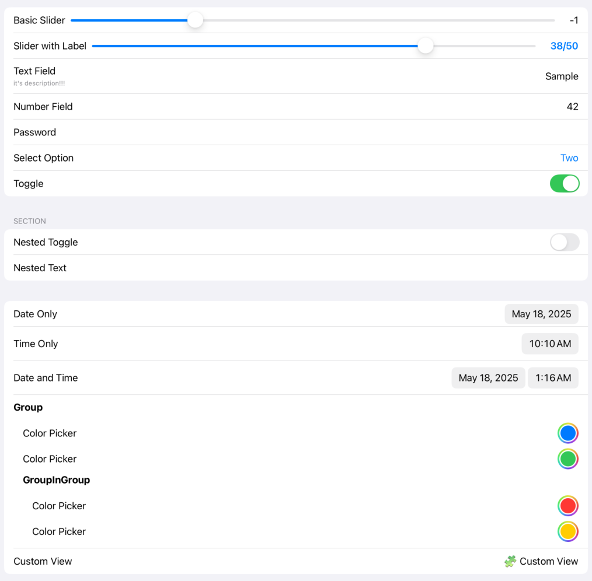
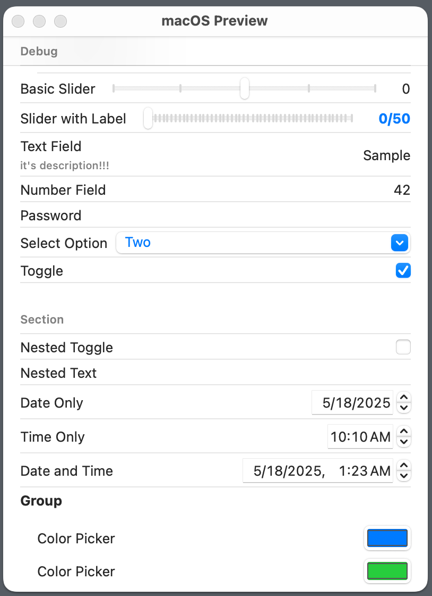

# SetThings
>“Spend less time on setting screens. Spend more time on meaning.” — Aristotle

A lightweight, flexible preference/settings view builder for SwiftUI.
Supports text, numbers, switches, dates, pickers, custom views and nesting.
Runs on iOS and macOS

## ✨ Features
- Simple API, fully SwiftUI-native
- Supports grouped layout and sectioned form structure
- Built-in support for:
    - .text
    - .number
    - .bool
    - .date
    - .time
    - .dateAndTime
    - .password
    - .selectString
    - .color
    - .view
    - .block
    - .group
    - .section
- Live value updates via onEdited
- Supports custom views via .view or .block

## 📦 Installation
```swift
.package(url: "https://github.com/southkin/SetThings.git", from: "1.0.0")
```

## 🚀 Usage
`SetThings` accepts any model conforming to the `ThingItem` protocol.

For example, you can define your own like this:

```swift
struct MinimalThingItem: ThingItem {
    var key: String = UUID().uuidString
    var name: String
    var type: ThingType
    var description: String?
}
```
and using this model
```swift
SetThings(items: [
    MinimalThingItem(
        key: "userID",
        name: "User ID",
        type: .text(placeholder: "Enter ID", defaultValue: "testUser")
    ),
    MinimalThingItem(
        key: "enable",
        name: "Enable",
        type: .bool(true)
    )
])
.onEdited { key, value in
    print("User changed \(key): \(String(describing: value))")
}
```

## 🧱 Available Types

| Type | Description |
| --- | --- |
| .text | Plain text input |
| .number | Decimal input (filtered) |
| .bool | Toggle switch |
| .password | Secure input |
| .selectString | Menu picker |
| .date | Date only (DateOnly) |
| .time | Time only (TimeOnly) |
| .dateAndTime | Full DatePicker |
| .color | Color picker |
| .view | Static view (no interactivity) |
| .block | Dynamic view with access to live values |
| .group | Indented group (can be nested) |
| .section | Section header (like a form section) |

## 📷 Screenshots
- code
    ```swift
    @State var editedValues: [String: Any] = [:]

    var body: some View {
        SetThings(items: [
            MinimalThingItem(name: "Debug", type: .section([
                MinimalThingItem(name: "", type: .block(AnyView(ValueSummaryView(values: $editedValues)))),
            ])),
            MinimalThingItem(key:"textField" , name: "Text Field", type: .text(placeholder: "Enter text", defaultValue: "Sample"), description: "it's description!!!"),
            MinimalThingItem(key:"numberField" , name: "Number Field", type: .number(placeholder: "1234", defaultValue: Decimal(42))),
            MinimalThingItem(key:"password" , name: "Password", type: .password(placeholder: "Secret")),
            MinimalThingItem(key:"option" , name: "Select Option", type: .selectString(["One", "Two", "Three"], defaultValue: "Two")),
            MinimalThingItem(key:"toggle" , name: "Toggle", type: .bool(true)),
            MinimalThingItem(name: "Section", type: .section([
                MinimalThingItem(key:"toggleInGroup" , name: "Nested Toggle", type: .bool(false)),
                MinimalThingItem(key:"textInGroup" , name: "Nested Text", type: .text(placeholder: "Nested"))
            ])),
            MinimalThingItem(key:"onlyDate" , name: "Date Only", type: .date(DateOnly(year: 2025, month: 1, day: 1))),
            MinimalThingItem(key:"onlyTime", name: "Time Only", type: .time(TimeOnly(hour: 10, minute: 10))),
            MinimalThingItem(key:"dateAndTime",name: "Date and Time", type: .dateAndTime(Date())),
            MinimalThingItem(name:"Group",type:.group([
                MinimalThingItem(key:"color1",name: "Color Picker", type: .color(.blue)),
                MinimalThingItem(key:"color2",name: "Color Picker", type: .color(.green)),
                MinimalThingItem(name:"GroupInGroup",type:.group([
                    MinimalThingItem(key:"color3",name: "Color Picker", type: .color(.red)),
                    MinimalThingItem(key:"color4",name: "Color Picker", type: .color(.yellow)),
                ])),
            ])),
            
            MinimalThingItem(name: "Custom View", type: .view(AnyView(Text("🧩 Custom View")))),
            
        ])
        .onEdited { key, value in
            editedValues[key] = value
            print("Edited: \(key) = \(String(describing: value))")
        }
    }
    ```
- iOS
    
- macOS
    
